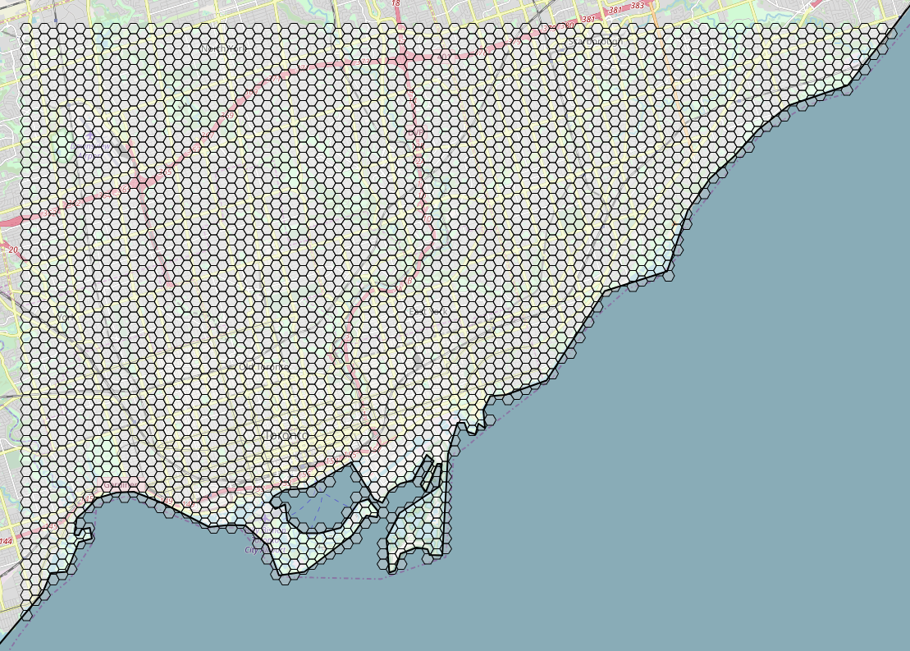

# turfjs-addon-polygonsNotInPolygon

A helper function that returns those polygons that are not contained within some target polygon.

In the example below, the polygons are the grid hexes while the target polygon is the custom geojson feature representing the coastline.



## Use

```
npm install
npm run build
```

### Run Example

```
npm run example
```

## Ward Data

Obtained from:

* https://open.toronto.ca/dataset/city-wards/
